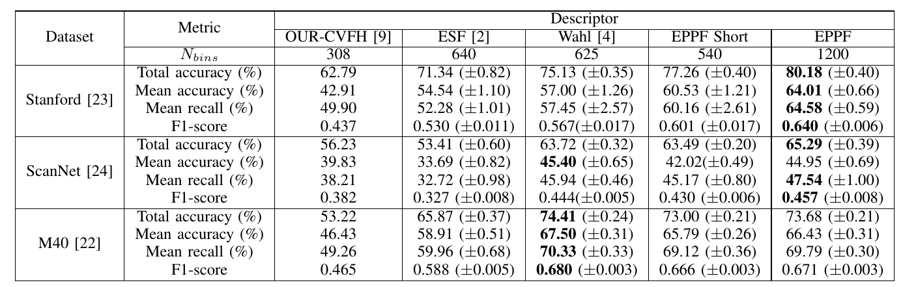

# Abstract

Object retrieval and classification in point cloud data is challenged by noise, irregular sampling density and occlusion. To address this issue, we propose a point pair descriptor that is robust to noise and occlusion and achieves high retrieval accuracy. We further show how the proposed descriptor can be used in a 4D convolutional neural network for the task of object classification. We propose a novel 4D convolutional layer that is able to learn class-specific clusters in the descriptor histograms. Finally, we provide experimental validation on 3 benchmark datasets, which confirms the superiority of the proposed approach.

# Main contributions

1. We present a novel 4D convolutional neural network architecture that takes a 4D descriptor as input and outperforms existing deep learning approaches on realistic point cloud datasets.

2. We design a handcrafted point pair function-based 4D descriptor that offers high robustness for realistic noisy point cloud data.

For full-text of the paper, see <a href="https://doi.org/10.1109/LRA.2018.2792681">IEEE version</a>.

<iframe width="846" height="480" src="https://www.youtube.com/embed/kQ6w4xA9VeU" frameborder="0" allow="autoplay; encrypted-media" allowfullscreen></iframe>

Code to be uploaded later.

# Overview of the pipeline

Fig.  Overview of the proposed object classification pipeline that is a combination of a novel handcrafted descriptor and a 4D convolutional neural network (CNN). Here, FC denotes a fully connected layer. 

Fig. Architecture of the proposed 4D neural network. 

# Results

TABLE I. Retrieval performance of the handcrafted descriptors. The mean value is given in the corresponding column, while
the standard deviation is given in brackets. Best performance is shown in bold.

Table II. Classification performance of deep learning approaches using 2D, 3D and 4D convolutional layers.

Fig. Descriptor and 4D neural network responses for the object table in the ScanNet dataset. Left: descriptor values. Middle: response of the first filter in the first layer. Right: filter response in the second layer. The rows show slices of the fourth dimension. Transparent bins correspond to constant offset values for the response (or 0 for the descriptor values), colored bins - to varying values. The bins are colored so that low values are shown in blue color, while high in red.

# Test

<table>
  <tr>
    <th rowspan="2">Dataset</th>
    <th rowspan="2">Metric</th>
    <th colspan="5">Descriptor</th>
  </tr>
  <tr>
    <td>OUR-CVFH</td>
    <td>ESF</td>
    <td>Wahl</td>
    <td>EPPF Short</td>
    <td>EPPF</td>
  </tr>
  <tr>
    <td rowspan="4">Stanford</td>
    <td>Total accuracy (%)</td>
    <td>62.79</td>
    <td>71.34</td>
    <td>75.13</td>
    <td>77.26</td>
    <td>80.18</td>
  </tr>
  <tr>
    <td>Mean accuracy (%)</td>
    <td>42.91</td>
    <td>54.54</td>
    <td>57.00</td>
    <td>60.53</td>
    <td>64.01</td>
  </tr>
  <tr>
    <td>Mean recall (%)</td>
    <td>49.90</td>
    <td>52.28</td>
    <td>57.45</td>
    <td>60.16</td>
    <td>64.58</td>
  </tr>
  <tr>
    <td>F1-score</td>
    <td>0.437</td>
    <td>0.530</td>
    <td>0.567</td>
    <td>0.601</td>
    <td>0.640</td>
  </tr>
  <tr>
    <td rowspan="4">ScanNet</td>
    <td>Total accuracy (%)</td>
    <td>56.23</td>
    <td>53.41</td>
    <td>63.72</td>
    <td>63.49</td>
    <td>65.29</td>
  </tr>
  <tr>
    <td>Mean accuracy (%)</td>
    <td>39.83</td>
    <td>33.69</td>
    <td>45.40</td>
    <td>42.02</td>
    <td>44.95</td>
  </tr>
  <tr>
    <td>Mean recall (%)</td>
    <td>38.21</td>
    <td>32.72</td>
    <td>45.94</td>
    <td>45.17</td>
    <td>47.54</td>
  </tr>
  <tr>
    <td>F1-score</td>
    <td>0.382</td>
    <td>0.327</td>
    <td>0.444</td>
    <td>0.430</td>
    <td>0.457</td>
  </tr>
  <tr>
    <td rowspan="4">M40</td>
    <td>Total accuracy (%)</td>
    <td>53.22</td>
    <td>65.87</td>
    <td>74.41</td>
    <td>73.00</td>
    <td>73.68</td>
  </tr>
  <tr>
    <td>Mean accuracy (%)</td>
    <td>46.43</td>
    <td>58.91</td>
    <td>67.50</td>
    <td>65.79</td>
    <td>66.43</td>
  </tr>
  <tr>
    <td>Mean recall (%)</td>
    <td>49.26</td>
    <td>59.96</td>
    <td>70.33</td>
    <td>69.12</td>
    <td>69.79</td>
  </tr>
  <tr>
    <td>F1-score</td>
    <td>0.465</td>
    <td>0.588</td>
    <td>0.680</td>
    <td>0.666</td>
    <td>0.671</td>
  </tr>
</table>

# References
1. C. R. Qi, H. Su, K. Mo, and L. J. Guibas, “Pointnet: Deep learning on point sets for 3d classification and segmentation,” Proceedings of the IEEE Conference on Computer Vision and Pattern Recognition (CVPR), 2017.

2. E. Wahl, U. Hillenbrand, and G. Hirzinger, “Surflet-pair-relation histograms: a statistical 3d-shape representation for rapid classification,” in Proceedings of IEEE International Conference on 3-D Digital Imaging and Modeling (3DIM), 2003, pp. 474–481.

# Contact
For any questions or inquiries, please contact Dmytro Bobkov at  with a subject "Object Descriptor RAL".

Last updated 21.02.2018